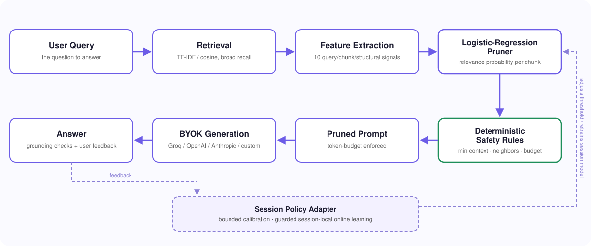

# Architecture

TokenThrift is a context gatekeeper for Retrieval-Augmented Generation. It
sits between retrieval and generation, scores the value of each retrieved
chunk, and builds a smaller prompt under a configurable token budget — while
keeping deterministic safety rules in the loop so pruning never silently
drops the evidence an answer actually needs.

The baseline and TokenThrift paths always start from the same retrieved
chunks and use the same generation model, prompt template, and temperature.
Only the context-selection step differs, so the two-column comparison in the
UI is an apples-to-apples measurement, not a demo trick.



## Pipeline

```
User Prompt
    -> Broad-Recall Retrieval        (TF-IDF/cosine, or an embedding retriever)
    -> Feature Extraction            (query, chunk, retrieval, and structural signals)
    -> Logistic-Regression Pruner    (relevance probability per chunk)
    -> Deterministic Safety Rules    (minimum context, neighbors, token budget)
    -> Token-Optimized Prompt
    -> BYOK Generation                (Groq / OpenAI / Anthropic / OpenRouter / any OpenAI-compatible endpoint)
    -> Answer Validation & Feedback  (grounding checks, explicit user signals)
    -> Session Policy Adapter        (bounded calibration; guarded online learning)
```

### Pruner interface

The pruner accepts the user query, ranked chunks with their source metadata,
the retriever's scores and ranks, a relevance threshold (or named preset),
and a maximum context-token budget. For every chunk it returns a calibrated
relevance score, a keep/prune decision, a short human-readable reason, and
whether a safety rule overrode the model. The final result carries the
ordered retained context, the pruned chunks, token counts, and summary
statistics.

### Why logistic regression

Inference is a small dot product, the model is inspectable, and its
probability-like output maps naturally onto an interactive threshold. It
isn't assumed to beat every alternative — the evaluation harness compares it
against retrieval-only threshold and top-k baselines.

### Classifier features

Ten inexpensive, structural signals — no embeddings required for the core
pruning decision:

| Feature | What it captures |
|---|---|
| `tfidf_similarity` | Cosine similarity between the query and chunk |
| `retrieval_rank` | The chunk's position in the broad-recall result set |
| `score_margin` | Similarity gap from the highest-scoring result |
| `query_token_overlap_ratio` | Normalized direct token overlap |
| `exact_phrase_overlap` | Whether meaningful multi-token query phrases appear |
| `title_or_heading_overlap` | Overlap with document titles or section headings |
| `entity_overlap` | Shared named entities or identifier-like terms |
| `normalized_chunk_length` | Length relative to other retrieved chunks |
| `source_type` | code / table / prose / other, from source metadata |
| `neighbor_relevance` | Signal from adjacent chunks in the same source |

Numeric or identifier-dense content is a weak feature on its own — it's
represented through `source_type` and structural features rather than a
blanket "numbers are important" rule.

## Training & model lifecycle

The base model is trained as an online-capable `SGDClassifier(loss="log_loss")`
— logistic regression that also supports guarded `partial_fit` updates
later. Training splits by question/document (not by chunk) so near-duplicate
chunks can't leak across train/validation/test. Feature preprocessing is
fit once on the training data and frozen at runtime — a session never
renormalizes features underneath the model's existing coefficients.

The persisted base model is **immutable at runtime**. Every session starts
from the same validated model and default policy; session adaptation
(below) never overwrites the shared artifact.

## Safety rules & failure behavior

ML scoring is always followed by deterministic safeguards:

- **Always keep the strongest result** — the top-ranked retrieval chunk is
  never pruned.
- **Minimum context** — a configurable minimum number of chunks is kept
  when available.
- **Boundary buffering** — a chunk scoring within `0.05` below the
  threshold is retained and flagged amber as borderline, not silently cut.
- **Neighbor preservation** — chunks adjacent to a highly relevant chunk are
  kept when they share a source and fit the budget.
- **Token-budget enforcement** — retained chunks are selected in stable
  retrieval order within budget; if a mandatory safety chunk would exceed
  it, the conflict is reported rather than silently truncated.
- **Transparent overrides** — the UI shows when a chunk was retained by a
  safety rule instead of the classifier.
- **Conservative fallback** — if the model or feature pipeline can't load,
  TokenThrift falls back to unpruned retrieval and reports that pruning was
  disabled. It never silently claims savings that didn't happen.

## Human-in-the-loop session adaptation

Two deliberately separate levels of adaptation, so "the app feels smarter
about my questions" and "the model weights actually changed" are never
conflated:

1. **Session calibration** — adjusts the relevance threshold, minimum
   context, or token budget within validated bounds. A verified pruning
   failure immediately makes the policy more conservative; repeated
   successful outcomes can cautiously permit more pruning.
2. **Session-local online learning (experimental)** — clones the immutable
   base classifier into session state and applies bounded `partial_fit`
   updates, but only when feedback yields high-confidence chunk labels.
   Guarded by: fixed preprocessing, conservative learning rate and
   regularization, bounded distance from the base coefficients, a canary
   evidence-recall check after every proposed update (reject/roll back on
   regression), and a one-click reset to the base model. No session ever
   updates a shared global model, and session-local weights are discarded
   when the session ends.

### Feedback attribution

Not every user action is a signal about pruning quality:

| Feedback event | Interpretation | Adaptation |
|---|---|---|
| Regenerate with identical context | Generation may have been stochastic/unsatisfactory | No pruner update |
| Thumbs-down / "incorrect" alone | Cause is ambiguous | Recorded; no weight update |
| Retry with full context, no improvement | Pruning probably wasn't the cause | No update |
| Retry with full context, answer improves via restored evidence | A required chunk was wrongly pruned | Policy becomes more conservative; high-confidence positive labels created |
| User explicitly marks a chunk irrelevant | Direct chunk-level judgment | Weighted negative label |
| User accepts a grounded answer | Weak positive signal | At most a small calibration nudge |

Absence of feedback is never treated as a positive label — TokenThrift
never assumes every retained chunk is relevant or every pruned chunk isn't.

### Layered answer check

A fast background check that assists attribution (it can't prove factual
correctness on its own): structured validation of requested identifiers/
numbers/dates/formats, query-coverage estimation, grounding of answer
claims to retained chunks, and — after negative feedback — an optional
counterfactual comparison against a full-context regeneration.

## Evaluation

Chunk-classification accuracy alone isn't the bar — the question is whether
the final answer stays supported by the evidence. Tracked metrics: evidence
recall, precision / false-negative rate, answer correctness vs. baseline,
citation/support coverage, token and estimated-cost reduction, pruning
latency (measured separately from generation), end-to-end latency, and —
for the adaptive path — calibration error, cumulative false-pruning rate,
and canary regressions.

Online adaptation is evaluated **chronologically**: predict and prune
first, reveal feedback second, update only afterward — so future feedback
can never leak into earlier predictions. This is what `tests/stage4_online_learning/`
and `src/tokenthrift/eval/online_protocol.py` enforce.

## Responsible claim language

Until a published benchmark exists for a given corpus/provider/model
combination, TokenThrift describes itself with targets and measured
outcomes, not guarantees:

- "Targets 40–70% token reduction on suitable workloads" — not "slashes
  cost by 40–70%."
- "Preserves measured answer quality at conservative settings" — not
  "guarantees correctness."
- "Low-overhead pruning, measured separately from generation" — not an
  unqualified latency promise.

The dashboard is built to make the tradeoff visible, not to hide it.
